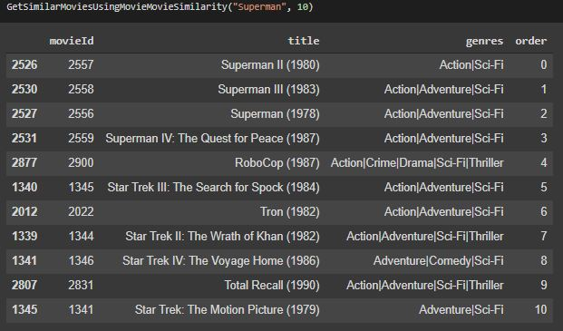
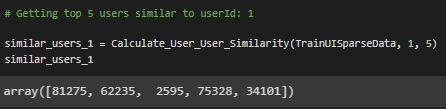
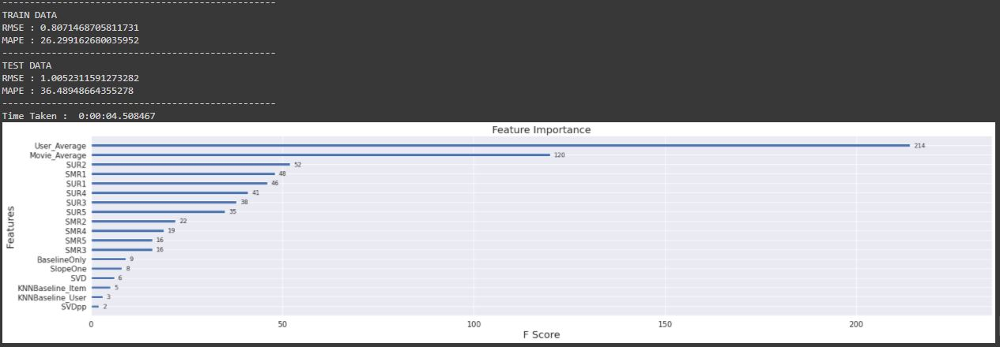
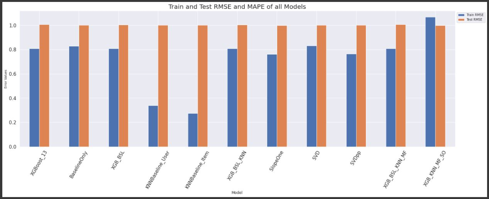
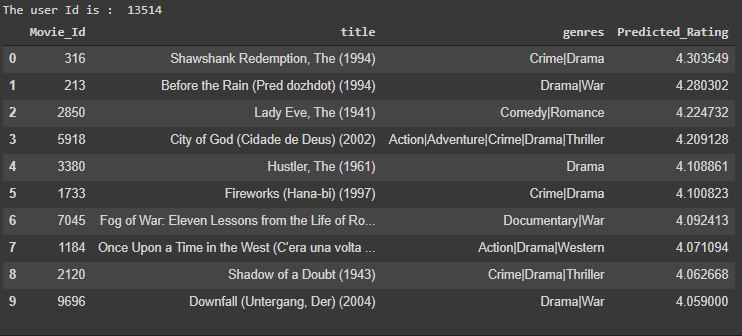

# Movie-Recommendation-System

 

## Business Objectives :

All entertainment websites or online stores have millions/billions of items. It becomes challenging for the customer to select the right one. Hence, recommender systems will come into the picture and help the user to find the right item by minimizing the options.

Recommendation Systems in the world of machine learning have become very popular and are of huge advantage to tech giants like Netflix, Amazon and many more to target their content to a specific audience. These recommendation engines are so strong in their predictions that they can dynamically alter the state of what the user sees on their page based on the user’s interaction with the app.

The business objectives for us are : 
1. To create a Collaborative Filtering based Movie Recommendation System
2. Predict the rating a user would give to a movie that he has not yet rated
3. Minimize the differences between predicted and actual ratings (RMSE and MAPE)

## Data Collection :

The dataset has been obtained from Grouplens.

Link : https://grouplens.org/datasets/movielens/20m/

This dataset (ml-20m) describes 5-star rating and free-text tagging activity from MovieLens, a movie recommendation service. It contains 20000263 ratings and 465564 tag applications across 27278 movies. These data were created by 138493 users between January 09, 1995 and March 31, 2015. This dataset was generated on October 17, 2016.

Users were selected at random for inclusion. All selected users had rated at least 20 movies. No demographic information is included. Each user is represented by an id, and no other information w provided.

The data are contained in the files genome-scores.csv, genome-tags.csv, links.csv, movies.csv, ratings.csv and tags.csv. 

For our objective, we would be using "ratings.csv" and "movies.csv" data files.

## Modelling :

The following modelling approach was used in the project:

1. Loading & exploring the Movie and User ratings data
2. Creating User-Item Matrix, User-User and Item-Item similarity matrices for Movie Recommendations
3. Creating feature and applying ML models to predict the ratings for unseen movies for a user

The detailed analysis and model creation can be found in the .ipynb file. 

## Result :

Some of the test images are shown below.

The results from Movie-Movie Similarity is as below:

The results from User-User Similarity is as below:

The Feature Importance for predicting ratings is as below:

The results from different ML models are as follows:

The sample movie recommendation based on Collaborative Filtering is as follows:

## Conclusions :

In this project, we learned the importance of Recommendation Systems, the types of recommender system being implemented, and how matrix factorization is used to enhance a system. 

We also built a movie recommendation system that considers user-user similarity, movie-movie similarity, global averages and matrix factorization. These concepts can be applied to any other user-item interactions systems.

We tried generating recommendations based on t similarity matrix and Collaborative Filtering techniques.

We tried to predict the ratings for movie the user might give based on its past rating behaviours and measure the accuracy using RMSE and MAPE error metrics.

Surely, there is huge scope of improvement and trying out different techniques and ML/DL algorithms.
